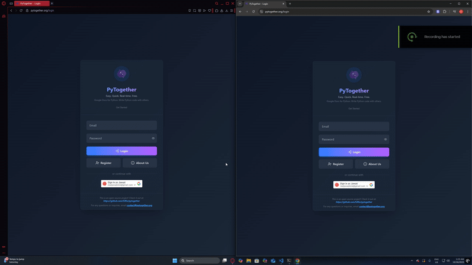

<p align="center">
  <br>
  <strong style="font-size: 24px;">PyTogether</strong><br>
  <em>Google Docs for Python. A simple, beginner-friendly collaborative IDE in the browser</em>
  <br>
  <br>
  <a href="https://www.pytogether.org">www.pytogether.org</a>
</p>

----

<p align="center">
  
</p>

----

## Features
- **Real-time Collaboration** - Edit Python code together instantly using Y.js.  
- **Secure Authentication** - Log in manually or with Google OAuth.  
- **Groups & Projects** - Organize your work into teams and projects.  
- **Smart Autosave** - Code is automatically saved every minute and on exit.  
- **Code Linting** - Integrated CodeMirror linting for cleaner, error-free code.  

## About
When starting out in programming, many beginners find traditional IDEs overwhelming: full of plugins, extensions, configuration steps, paywalls, and complex UIs. PyTogether removes these barriers by offering a lightweight, distraction-free environment where you can focus on writing Python code right away.  

The platform is designed for **learning, teaching, and pair programming**, making it ideal for classrooms, coding clubs, or quick collaborations.  

> **Note:** PyTogether is intended for educational purposes and beginner use. It is *not* optimized for large-scale production development.

## Why PyTogether?  

While there are many online IDEs (Replit, Jupyter, Google Colab, etc.), PyTogether is built with a different goal: **simplicity first**.  

- ⚡**Instant Setup**⚡- No downloads, no pip installs, no hidden complexity. Just create a group, create a project, and bam!
- **Beginner Focused** - No confusing menus, terminals, or configuration. Just code and run.  
- **Real-Time Collaboration** - Work together with classmates, friends, or mentors in the same editor.  
- **Safe Learning Space** - Limited features by design to reduce distractions and keep beginners focused.  

Unlike production-grade IDEs, PyTogether prioritizes **ease of use and collaboration for learners** rather than advanced features.

## Tech Stack
- **Backend:** Django/DRF (REST APIs), Redis (used for channel layers, broker for celery, and caching), Celery (async tasks e.g. autosaving)
- **Datastore:** Supabase (PostgreSQL)
- **Frontend:** React, TailwindCSS, Skulpt (used to run python in the browser), CodeMirror (linting)
- **Deployment:** Vercel (frontend hosting), Contabo VPS (backend services, Dockerized)
- **Tools and Infra:** Docker, Nginx (for reverse proxy)

## Usage
- Requirements: Docker, PostgreSQL database credentials

Before running a development server, you must create a .env file in the backend folder (pytogether/backend/) with the following variables:

```env
DJANGO_SECRET_KEY="some-crazy-random-string"

POSTGRES_DB=postgres
POSTGRES_USER=postgresusername
POSTGRES_PASSWORD=postgrespassword
POSTGRES_HOST=postgreshost
POSTGRES_PORT=5432
DATABASE_URL=your/postgres/database/url/combining/all/the/above
```
You can also configure basic settings in backend/backend/settings.
Then, in your terminal, run the following in the project root (MAKE SURE DOCKER IS RUNNING):
```bash
docker compose -f docker-compose-dev.yaml up
```
Your backend should now be running on http://localhost:8000

Now start your frontend with the following command in your project root:
```bash
cd frontend/reactapp
npm run dev
```
The frontend will be live on http://localhost:5173


